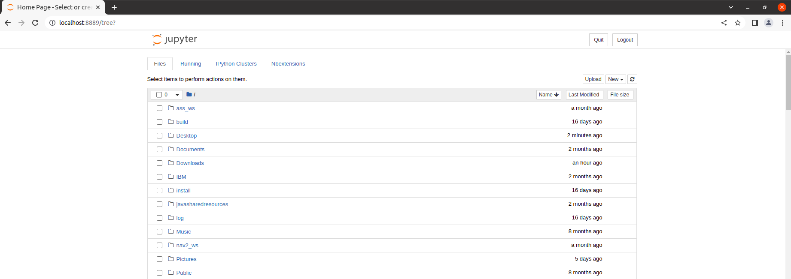

[Research Track II](https://corsi.unige.it/en/off.f/2022/ins/60236)<br>
**Programmer:** [Ankur Kohli](https://github.com/ankurkohli007)<br>
[M.Sc Robotics Engineering](https://corsi.unige.it/corsi/10635)<br>
[University of Genoa (UniGe)](https://unige.it/en)<br>
**Supervisor:** [Prof. Carmine Tommaso Recchiuto](https://rubrica.unige.it/personale/UkNDWV1r)

# Jupyter Notebook User Interface for Software Architecture for Mobile Robot Control

## Abstract
[Jupyter Notebook](https://jupyter.org/) is an open source web application which is used to create and share documents that contain real-time code, equation, data visualizations, text, and so on. This Jupyetr Nootebook is designed to create the SUer Interface of [my code](https://github.com/ankurkohli007/Research_Track_I_Assignment_3.git). Also, this notebook is developed as an user interface for the the project [Software Architecture for Mobile Robot Control](https://github.com/ankurkohli007/Research_Track_I_Assignment_3.git). For this, ***Jupyter Notebook*** tool is used.

## Introduction
Jupyter Notebooks are a spin-off project from the IPython project, which is used to have an IPython
Notebook project itself. The IPython Kernel, which allows us to write our program in Python, but there are currently over 100 other kernels that can also be used. The Jupyter Notebook is not included with Python, so if we want to try it out, we will need to install Jupyter on our system.

## Objective
This user interface should be able to control the project [Software Architecture for Mobile Robot Control](https://github.com/ankurkohli007/Research_Track_I_Assignment_3.git). Also, user can operates and change the robot's behvaiour depending on their choice. Robot's Behvaiour can be ***autonomous drive***, ***manual drive using teleop***, and ***manual drive using teleop and avoiding the collisions***. 

## Installation
To create Jupyter Interface, *Jupyter Notebook* tool is required on your system. To install Jupyter follow the steps given below:

```
pip3 install jupyter bqplot pyyaml ipywidgets
```
```
jupyter nbextension enable --py widgetsnbextension
```
Now, with these two commands Jupyter is installed, let’s start with the interface for the project **Software Architecture for Mobile Robot Control**. To get started, all you need to do is open up your terminal application and go to a folder of your choice. Then run the below command:
```
jupyter notebook --allow-root
```
*Note:* The ***--allow-root*** option is only necessary if you are using the Docker Image.
Also, in the docker you will probably need to update firefox with ```apt-get install firefox```)

Below is the figure which shows ***Notebook Server***. 

 

Now, click on the *New* button on the right corner as shown in the figure above. After clicking on this button, it will open a dialogue box which shows the list. Aslo, this python versions installed in your system. In the *Docker image* you should have only Python3 installed. 

 

Figure above shows the first Jupyter Document web page.

## Jupyter and ROS

Jupyter Notebooks may be used and integrated with ROS called as [Jupyter-Ros](https://jupyter-ros.readthedocs.io/en/latest/). As for the other libraries, we need to install some extensions: 
```
pip3 install jupyros
```
For the publishing, the package contains tools to automatically generate widgets from message definitions. 
```
import jupyros as jr
import rospy
from std_msgs.msg import String
rospy.init_node('jupyter_node')
jr.publish('/sometopic', String)
```
This results in a jupyter widget where one can insert the desired message in the text field. The form fields (jupyter widgets) are generated automatically from the message definition. If we use a a different message type, we will get different fields.

**ROS3D** communicates with ROS via websocket. This communication is configured through the jupyter widgets protocol, but you are also required to run the *“rosbridge websocket”* package in your ROS environment (or launch file). For this, you need to make sure that you have ros-noetic-rosbridge-suite and ros-noetic-tf2-webrepublisher. Thus, for this example, install:
```
apt-get install ros-noetic-rosbridge-suit
```
```
apt-get install ros-noetic-tf2-web-republisher
```
```
apt-get install ros-noetic-slam-gmapping
```
```
apt-get install ros-noetic-move-base
```
For non-Docker Image user execute the aforementioned command by adding ***sudo*** in front. 

## Description of the Jupyter Code

The Jupyter user interface node is a super easy node. This is used to control the robot's behaviour. This implementation will demonstrates that robot's behavior such as switching to the different modalities such as:

* Autonomously reach a x,y coordinate inserted by the user
* Letting the user drive the robot with the keyboard
* Letting the user drive the robot assisting them to avoid collisions 

Additionally, these modalities can also be managed by using this interface. 

First, imported the required libraries as given below:
```
from ipywidgets import Button, Layout, ButtonStyle, GridBox, VBox, HBox 
import ipywidgets as widgets
import rospy
import jupyros as jr
from std_msgs.msg import String
import ipywidgets as widgets
from IPython.display import display

# importing custom message from the final_assignment
from final_assignment.msg import Avoid
from geometry_msgs.msg import Twist
```

After importing the libraries now initialize the ROS node for Jupyter and set parameters.
```
# initializing the ROS node for Jupyter
rospy.init_node('jupyter_node')
# setting the parameters 
rospy.set_param('active', 0)
```


