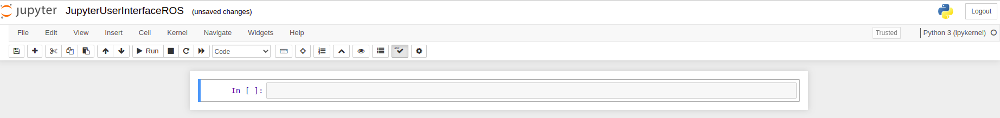

[Research Track II](https://corsi.unige.it/en/off.f/2022/ins/60236)<br>
**Programmer:** [Ankur Kohli](https://github.com/ankurkohli007)<br>
[M.Sc Robotics Engineering](https://corsi.unige.it/corsi/10635)<br>
[University of Genoa (UniGe), Italy](https://unige.it/en)<br>
**Supervisor:** [Prof. Carmine Tommaso Recchiuto](https://rubrica.unige.it/personale/UkNDWV1r)

# Jupyter Notebook User Interface for [Software Architecture for Mobile Robot Control](https://github.com/ankurkohli007/Research_Track_I_Assignment_3.git)

## Abstract
[Jupyter Notebook](https://jupyter.org/) is an open source web application which is used to create and share documents that contain real-time code, equation, data visualizations, text, and so on. This Jupyetr Nootebook is designed to create the User Interface of [my code](https://github.com/ankurkohli007/Research_Track_I_Assignment_3.git). Also, this notebook is developed as an user interface for the the project [Software Architecture for Mobile Robot Control](https://github.com/ankurkohli007/Research_Track_I_Assignment_3.git). For this, ***Jupyter Notebook*** tool is used.

## Introduction
Jupyter Notebooks are a spin-off project from the IPython project, which is used to have an IPython
Notebook project itself. The IPython Kernel, which allows us to write our program in Python, but there are currently over 100 other kernels that can also be used. The Jupyter Notebook is not included with Python, so if we want to try it out, we will need to install Jupyter on our system.

## Objective
This user interface should be able to control the project [Software Architecture for Mobile Robot Control](https://github.com/ankurkohli007/Research_Track_I_Assignment_3.git). Also, user can operates and change the robot's behvaiour depending on their choice. Robot's Behvaiour can be ***autonomous drive***, ***manual drive using teleop***, and ***manual drive using teleop and avoiding the collisions***. 

## Installation
To create Jupyter Interface, *Jupyter Notebook* tool is required on your system. To install Jupyter follow the steps given below:

```
pip3 install jupyter bqplot pyyaml ipywidgets
```
```
jupyter nbextension enable --py widgetsnbextension
```

* **Note:** If you find errors such as *ImportError: No module named widgetsnbextension*. To resolve such kind of error follow the below links.
      <ul>
      <li>[Link 1](http://github.com/jupyter-widgets/pywidgets/issues/568) to know what actual the erro is about.</li>
      <li>[Link 2](http://lpywidgets.readthedocs.io/en/stable/user_install.html) command to resolve the error.</li>
      </ul>


Now, with these two commands Jupyter is installed, let’s start with the interface for the project **Software Architecture for Mobile Robot Control**. To get started, all you need to do is open up your terminal application and go to a folder of your choice. Then run the below command:
```
jupyter notebook --allow-root
```
*Note:* The ***--allow-root*** option is only necessary if you are using the Docker Image.
Also, in the docker you will probably need to update firefox with ```apt-get install firefox```)

Below is the figure which shows ***Notebook Server***. 

 

<p align="center">
    <em>JupyterNotebbok GUI</em>
</p>

Now, click on the *New* button on the right corner as shown in the figure above. After clicking on this button, it will open a dialogue box which shows the list. Aslo, this python versions installed in your system. In the *Docker image* you should have only Python3 installed. 

 

<p align="center">
    <em>JupyterNotebook Web Page</em>
</p>

Figure above shows the first Jupyter Document web page.

## Jupyter and ROS

Jupyter Notebooks may be used and integrated with ROS called as [Jupyter-Ros](https://jupyter-ros.readthedocs.io/en/latest/). As for the other libraries, we need to install some extensions: 
```
pip3 install jupyros
```
For the publishing, the package contains tools to automatically generate widgets from message definitions. 
```python
import jupyros as jr
import rospy
from std_msgs.msg import String
rospy.init_node('jupyter_node')
jr.publish('/sometopic', String)
```
This results in a jupyter widget where one can insert the desired message in the text field. The form fields (jupyter widgets) are generated automatically from the message definition. If we use a a different message type, we will get different fields.

**ROS3D** communicates with ROS via websocket. This communication is configured through the jupyter widgets protocol, but you are also required to run the *“rosbridge websocket”* package in your ROS environment (or launch file). For this, you need to make sure that you have ros-noetic-rosbridge-suite and ros-noetic-tf2-webrepublisher. Thus, for this example, install:
```
apt-get install ros-noetic-rosbridge-suit
```
```
apt-get install ros-noetic-tf2-web-republisher
```
```
apt-get install ros-noetic-slam-gmapping
```
```
apt-get install ros-noetic-move-base
```
For non-Docker Image user execute the aforementioned command by adding ***sudo*** in front. 

## Description of the Jupyter Code

The Jupyter user interface node is a super easy node. This is used to control the robot's behaviour. This implementation will demonstrates that robot's behavior such as switching to the different modalities such as:

* Autonomously reach a x,y coordinate inserted by the user
* Letting the user drive the robot with the keyboard
* Letting the user drive the robot assisting them to avoid collisions 

Additionally, these modalities can also be managed by using this interface. 

First, imported the required libraries as given below:
```python
from ipywidgets import Button, Layout, ButtonStyle, GridBox, VBox, HBox 
import ipywidgets as widgets
import rospy
import jupyros as jr
from std_msgs.msg import String
import ipywidgets as widgets
from IPython.display import display

# importing custom message from the final_assignment
from final_assignment.msg import Avoid
from geometry_msgs.msg import Twist
```

After importing the libraries now initialize the ROS node for Jupyter and set parameters.
```python
# initializing the ROS node for Jupyter
rospy.init_node('jupyter_node')
# setting the parameters 
rospy.set_param('active', 0)
```
Below are the option Key for robots's modalities:
```python
k1 = Button(description='Autonomously Reach',
            layout=Layout(width='auto', align="center", grid_area='k1'),
            style=ButtonStyle(button_color='lightblue'))

k2 = Button(description='Teleop Operation',
            llayout=Layout(width='auto', grid_area='k2'),
            style=ButtonStyle(button_color='moccasin'))

k3 = Button(description='Obstacle Avoidance',
            layout=Layout(width='auto', grid_area='k3'),
            style=ButtonStyle(button_color='pink'))

k4 = Button(description='Quit',
            layout=Layout(width='auto', grid_area='k4'),
            style=ButtonStyle(button_color='salmon'))

k5 = Button(description='Setting x,y coordinates',
            layout=Layout(width='auto', grid_area='k5'),
            style=ButtonStyle(button_color='lightgreen'))
```
Below is the function to define key for autonomous reach and teleop operation of the robot: 
```python
# Function to define key for autonomous reach of the robot    
def key_option_autonomous_reach(k): 
    global avoid
    avoid = False
    
    print("Please enter the x,y coordinates for robot to reach autonomously and then press the selected key for okay ")
    
    display(des_x)
    display(des_y)
    
    display(k5,output)
    
# Function to define key to operate robot using teleop i.e. keyboard        
def key_option__teleop_operation(k):
    global avoid
    avoid = False
    
    print("Pressed key: " + str(k.description))
    rospy.set_param('active', 2)
    
    # display
    display(GridBox(children=[k_front, k_back, k_left, k_right, k_stop],
        layout=Layout(
       
            width='45%',
            grid_template_rows='auto',
            grid_template_columns='33% 33% 33%',
            grid_template_areas='''
            ". Front ."
            "Left Right"
            ". Back ."
            ".      ."
            ". Stop ."
            ''')  
       ))
```
Furthermore, functions are defined for the obstacle avoidance and to quit operation.
```python
 Function to define key to avoid obstacle while accomplishing the target
def key_option_obstacle_avoidance(k): 
    global avoid
    avoid = True
    
    print("Pressed key " + str(k.description))
    rospy.set_param('active', 3)
    
    display(GridBox(children=[k_front, k_back, k_left, k_right, k_stop],
        layout=Layout(
       
            width='45%',
            grid_template_rows='auto',
            grid_template_columns='33% 33% 33%',
            grid_template_areas='''
            ". Front ."
            "Left Right"
            ". Back ."
            ".      ."
            ". Stop ."
            ''')  
       ))

# Function to define Quit operations
def key_option_quit(k): 
    global avoid
    avoid = False
    
    print("Pressed key " + str(k.description))
    rospy.set_param('active', 0)
```
The code below shows the buttons to change the modalities of the robot: 
```python
k1.on_click(key_option_autonomous_reach)
k2.on_click(key_option__teleop_operation)
k3.on_click(key_option_obstacle_avoidance)
k4.on_click(key_option_obstacle_avoidance)

k5.on_click(set_target)

k_front.on_click(front_drive)
k_back.on_click(back_drive)
k_left.on_click(left_drive)
k_right.on_click(right_drive)

k_stop.on_click(stopped)

print("Plesase select the modoalities for robot's behaviour ")

GridBox(children=[k1, k2, k3, k4],
        layout=Layout(
       
            width='40%',
            grid_template_rows='auto auto',
            grid_template_columns='50% 50%',
            grid_template_areas='''
            "k1 k2 "
            "k3 k4 "
            ''')  
       )
```
<p align="center">
  
</p>

<p align="center">
    <em>GUI to Control robot behaviour</em>
</p>

Figure above shows the display of the buttons for the user interface to control the robot's behvaiour. 

## Description of the code for the Graphical Representation of the Robot's Odometry & Laser Scanner

This part will demonstrates the graphical representation of the robot's behavior during the Simulation.

* The first graph will represents the laser scan on a polar graph representation 
* The second graph will represents the position described by the odometry topic of the robot. The graph will show the position of the robot in space with red dots. 
* The third graph will represents the values retrieved by the laser scan arrays the robot is equipped with.

Below is the function shows the plotting of the data of the robot's odometery and laser scanner.

```python
def plot_init(self): 
        
        self.ax.set_title("Robot's Odometry\n",fontweight="bold")
        self.ax.set_xlim(-20, 20) 
        self.ax.set_ylim(-20, 20) 
        self.ax.set_xlabel("X [m]",fontweight="bold")
        self.ax.set_ylabel("Y [m]",fontweight="bold")
        
        self.ax2.set_title("Laser Scanner\n",fontweight="bold")
        self.ax2.set_xlim(0, 720)
        self.ax2.set_ylim(0,31)
        self.ax2.set_xlabel("X [m]",fontweight="bold")
        self.ax2.set_ylabel("Y [m]",fontweight="bold")
        
        self.ax_p.set_title("Laser scanner (polar)\n",fontweight="bold")
        self.ax_p.set_ylabel("Distance [m]",fontweight="bold")
        self.ax_p.set_rmax(20)
        
        return self.ln, self.ln2, self.lnp
```
Figure below shows the data visualization of the robot's odometery and laser scanner.

<p align="center">
  
</p>

<p align="center">
    <em>Laser scanner graphical representation</em>
</p> 

Figure above shows the graphical representation of the robot's laser scanner in polar form.

<p align="center">
  
</p>

<p align="center">
    <em>Robot's Odometery graphical represenatation</em>
</p>

Figure above shows the graphical representation of the robot's odometery.

<p align="center">
  
</p>

<p align="center">
    <em>Graphical representation of Robot's laser array</em>
</p>

Figure above shows the graphical representation of the robot's laser array.

#### Target Node to check the robot's state

This will depicts that whether the robot reached at the target or not. This will define by the graphical representation.
```python
class DataVisualization:
    
    # initialization
    def __init__(self):
        self.fig, self.ax = plt.subplots() 
        self.ln_g, = plt.plot([], [], 'go',label='Reached')
        self.ln_r, = plt.plot([], [], 'ro',label='Aborted')
        self.ln_x, = plt.plot([], [], 'yo',label='Not-reached')
        
        plt.grid()
        plt.xlabel("x[m]")
        plt.ylabel("y[m]")
        plt.legend(handles=[self.ln_g, self.ln_r,self.ln_x], loc='lower right')
        
        self.x_data_g, self.y_data_g = [] , []
        self.x_data_r, self.y_data_r = [] , []
        self.x_data_x, self.y_data_x = [] , []
        
    def plot_init(self): 
        self.ax.set_xlim(-20, 20) 
        self.ax.set_ylim(-20, 20) 
        
        return self.ln_g, self.ln_r, self.ln_x
    
    def CallBack_status(self, msg): 
        
        global status 
        global position_x
        global position_y
        
        try:
            status.append(msg.status_list[0].status)

            position_x = rospy.get_param("des_pos_x")
            position_y = rospy.get_param("des_pos_y")


            if status[-1] == 1 and status[-2] != 1:

                self.y_data_x.append(pos_y) 
                self.x_data_x.append(pos_x)

            elif (status[-1] == 2 and status[-2] != 2) or (status[-1] == 4 and status[-2] != 4):

                self.y_data_x.clear()
                self.x_data_x.clear()
                self.y_data_r.append(position_y) 
                self.x_data_r.append(position_x)

            elif status[-1] == 3 and status[-2] != 3:

                self.y_data_x.clear()
                self.x_data_x.clear()
                self.y_data_g.append(position_y) 
                self.x_data_g.append(position_x)
                
        except IndexError:
            pass
        
    
    def update_plot(self, frame):
        
        self.ln_g.set_data(self.x_data_g, self.y_data_g)
        self.ln_r.set_data(self.x_data_r, self.y_data_r)
        self.ln_x.set_data(self.x_data_x, self.y_data_x)

        return self.ln_g,self.ln_r,self.ln_xe
            
       
        

datavis3 = DataVisualization()
sub = rospy.Subscriber('/move_base/status', GoalStatusArray, datavis3.CallBack_status)

ani = FuncAnimation(datavis3.fig, datavis3.update_plot, init_func = datavis3.plot_init)


        
plt.show(block=True)
```
 

Figure above shows the graphical representation of the robot's target reach.

* **Note:** For complete Jupyter Code [click here](JupyterNotebook/jupyter_userinterface.ipynb).

## Conclusion and Improvements

I'm satisfied with the final result, even if better improvements can be done. First of all some parameters can be changed since they may be not optimal. Having said that, there are some particular improvenments that I want to highlight:

* In jupyter notebook data real time data is updating using ```%matplotlib widget``` but at some stage it's lagged and due to this data updation is lagged. This can be improve in further imporvement of the code.

Below are the two improvements which is based on the project [Software Architecture for Mobile Robot Control](https://github.com/ankurkohli007/Research_Track_I_Assignment_3.git).

* In the assisted driving mode, the robot avoid obstacles in the front/left/right related to its vision field, but since it can go also backwards it will inevitably crush on the back side, not avoiding the wall. Future improvements can be done, in order to avoid hitting the wall on the back side, probably using the geometry and the space of the environment.
* In the reach point node, we may compute the current position of the robot in the environment and match it to the goal position in order to have an instant feedback if the robot has reached the Point(x,y). The ROS topic `base_scan/status` takes a long time to control if the robot has reached the goal.
